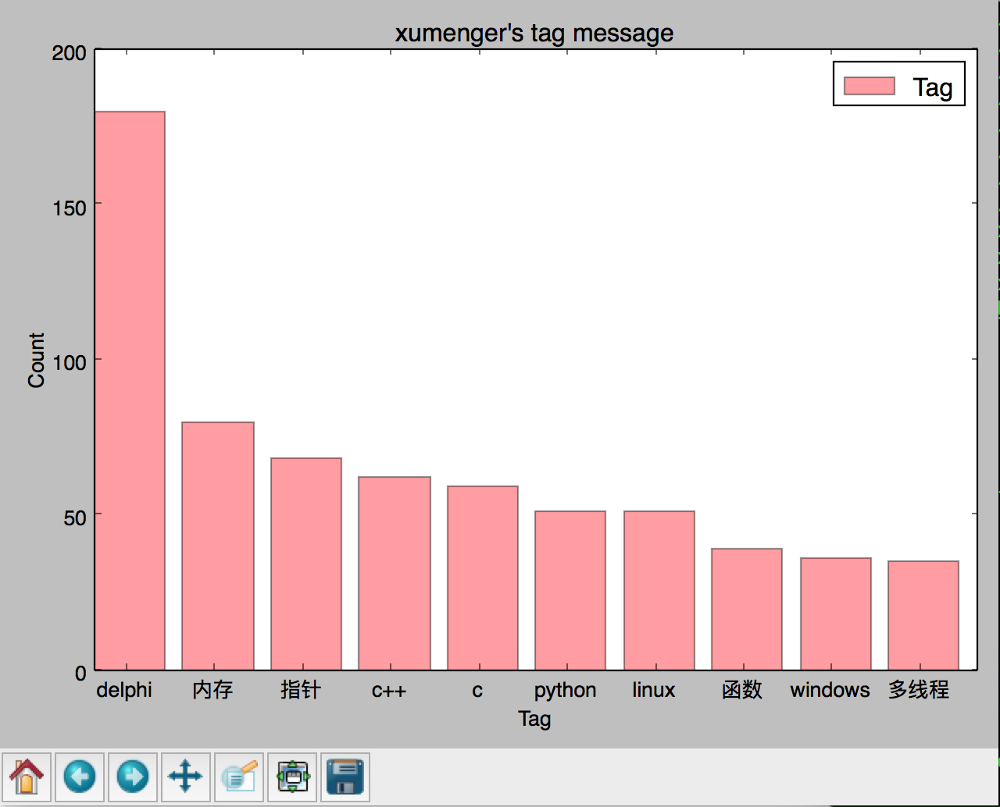

##xumenger

[http://www.xumenger.com](http://www.xumenger.com)

爬所有的博客，统计所有博客下的标签分布情况，用图表的方式进行展示

参考[《Python数据科学基础：用Numpy、matplotlib、pandas包简单分析数据》](http://www.xumenger.com/python-data-science-02-20170109/)搭建Python虚拟环境、安装matplotlib

##运行效果

执行下面的命令，运行爬虫

```
python start.py
```

然后会自动爬取并统计tag信息，并且通过图表进行展示

